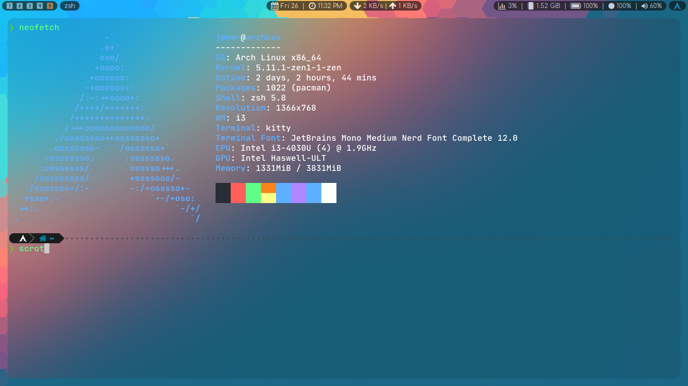

# Welcome to my dotfiles repo

This repo contains config files for most of the stuff that I use on my system.

You can use them any way you want!

I have added screenshots of some of these, so that
you can see what they look like, before you start using them.

**Plus**, there's a [**spec sheet**](#spec-sheet) which lists
some of the programs and links to their website/repos.

### Neofetch

### Spec Sheet

| Spec                   | Program                                  |
| ---------------------- | ---------------------------------------- |
| **Distro:**            | [Arch Linux][arch]                       |
| **Window Manager:**    | [i3-gaps][i3]                            |
| **Terminal:**          | [Kitty][kitty]                           |
| **Shell:**             | zsh                                      |
| **Editor:**            | [Neovim][neovim]                         |
| **Status Bar:**        | [Polybar][polybar]                       |
| **Compositor:**        | [picom-ibhagwan-git][picom]              |
| **Display Font:**      | [Comfortaa][comforta]                    |
| **Termial Font:**      | [JetBrains Mono Nerd Font][nf-jetbrains] |
| **GTK/Kvantum Theme:** | [Adapta Nokto Eta][adapta]               |
| **Icon Theme:**        | [Mcmojave Circle Icons][mcmojave]        |
| **Termial Theme:**     | [Purify][purify]                         |
| **App Launcher:**      | [Alber][albert], [rofi][rofi]            |

### Screenshots

More screenshots are coming soon!

[arch]: https://archlinux.org
[i3]: https://github.com/Airblader/i3
[kitty]: https://github.com/kovidgoyal/kitty
[neovim]: https://github.com/neovim/neovim
[polybar]: https://github.com/polybar/polybar
[picom]: https://github.com/ibhagwan/picom
[comforta]: https://fonts.google.com/specimen/Comfortaa
[nf-jetbrains]: https://github.com/ryanoasis/nerd-fonts/tree/master/patched-fonts/JetBrainsMono
[adapta]: https://github.com/adapta-project/adapta-gtk-theme
[mcmojave]: https://github.com/vinceliuice/McMojave-circle
[purify]: https://github.com/kyoz/purify
[albert]: https://github.com/albertlauncher/albert
[rofi]: https://github.com/davatorium/rofi
